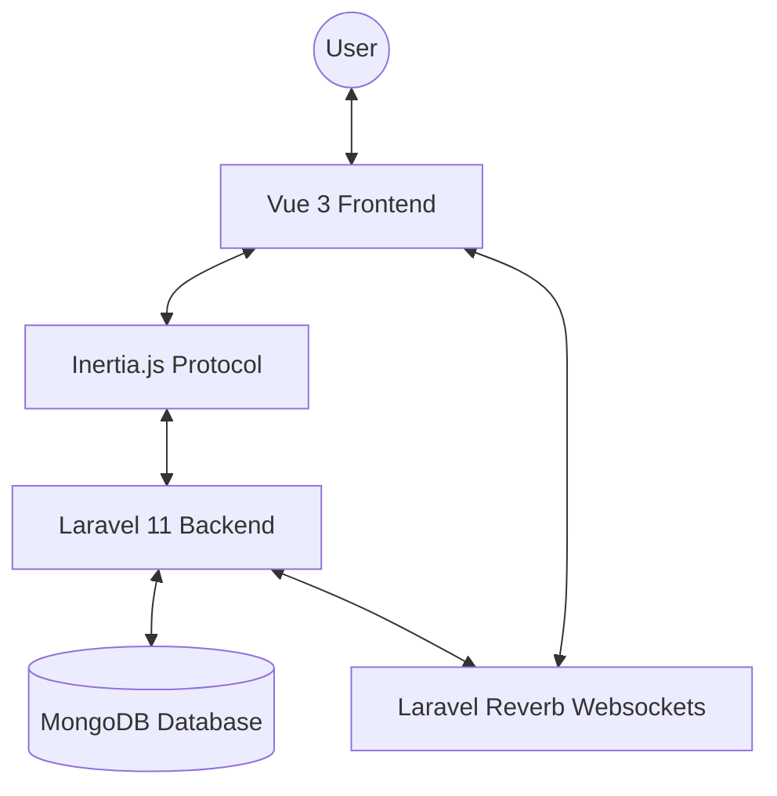

# Architecture Overview

This project follows a modern web application architecture combining Laravel, Vue.js, Inertia.js, and MongoDB.

## High-Level Architecture



### Frontend (Vue 3 + Inertia.js)

- **Vue 3**: Used for building the interactive user interface.
- **Inertia.js**: Acts as the bridge between the backend and frontend, allowing for a single-page application (SPA) experience without the complexity of a separate API layer.
- **Tailwind CSS**: Used for styling the application.
- **Components**: Located in `resources/js/Pages` and `resources/js/Components`.

### Backend (Laravel 11)

- **Routing**: Handled in `routes/web.php` and `routes/auth.php`.
- **Controllers**: Logic is encapsulated in controllers located in `app/Http/Controllers`.
- **Models**: MongoDB models located in `app/Models`, utilizing the `mongodb/laravel-mongodb` package.
- **Middleware**: Role-based access control is implemented via custom middleware.

### Database (MongoDB)

- **MongoDB**: Used as the primary data store, providing flexibility with document-based storage.
- **Migrations**: Regular Laravel migrations are used to define the structure of MongoDB collections.

### Real-time (Laravel Reverb)

- **Reverb**: Provides real-time capabilities for features like the chat system.
```
